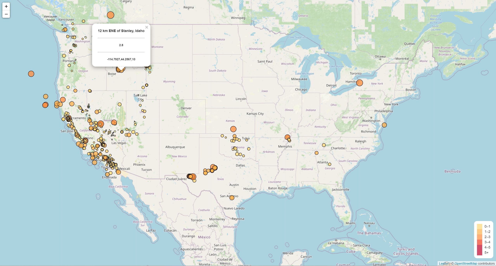

# leaflet-challenge

# Create the Earthquake Visualization
Get your dataset. To do so, follow these steps:

The USGS provides earthquake data in a number of different formats, updated every 5 minutes. Visit the USGS GeoJSON Feed Links to an external site.page and choose a dataset to visualize. 
When you click a dataset (such as "All Earthquakes from the Past 7 Days"), you will be given a JSON representation of that data. Use the URL of this JSON to pull in the data for the visualization.
Import and visualize the data by doing the following:

Using Leaflet, create a map that plots all the earthquakes from your dataset based on their longitude and latitude.

Your data markers should reflect the magnitude of the earthquake by their size and the depth of the earthquake by color. Earthquakes with higher magnitudes should appear larger, and earthquakes with greater depth should appear darker in color.

Hint: The depth of the earth can be found as the third coordinate for each earthquake.

Include popups that provide additional information about the earthquake when its associated marker is clicked.

Create a legend that will provide context for your map data.

# Earthquake Visualization

